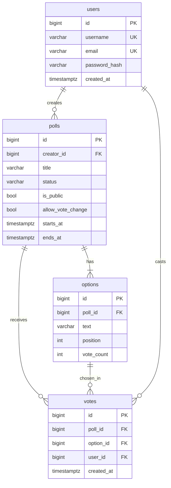
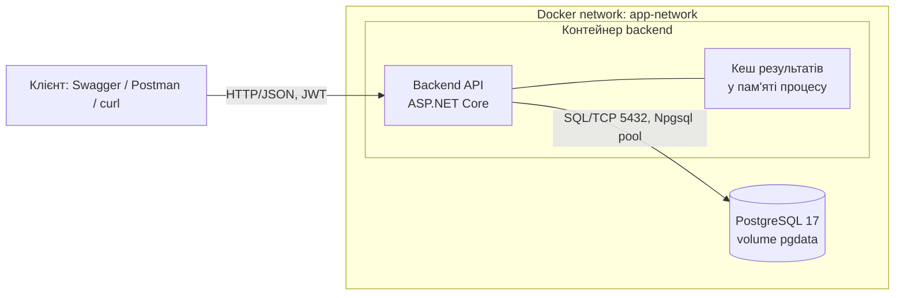

# Платформа опитувань — Highload Systems Practice

Наш варіант — платформа опитувань у реальному часі. Проєкт розвивається від лаби 1 (MVP) до лаби 5 (навантажувальне тестування); методички та дизайн-документи — у [`docs/`](docs/).

> Контекст для учасників і AI-агентів: [`CLAUDE.md`](CLAUDE.md) → [`docs/ai/`](docs/ai/status.md) (стан, рішення/ADR, контракти, runbook, журнал сесій).

**Стек:** C# / ASP.NET Core 10 · EF Core 10 + Npgsql · PostgreSQL 17 · JWT · FluentValidation · Docker Compose

## Швидкий старт

Потрібен лише Docker.

```bash
docker compose up -d --build
```

| Що | Адреса |
|---|---|
| API | http://localhost:8080 |
| Swagger UI | http://localhost:8080/swagger |
| Health check | http://localhost:8080/health |
| PostgreSQL (з хоста) | `localhost:5433`, БД/користувач/пароль `polling` |
| Adminer (опційно) | `docker compose --profile tools up -d` → http://localhost:8081 |

При старті backend сам застосовує міграції та заповнює порожню БД тестовими даними. Жодних ручних кроків не потрібно. Значення за замовчуванням можна перевизначити через `.env` (див. [`.env.example`](.env.example)).

```bash
docker compose restart postgres   # дані переживають перезапуск БД (named volume pgdata)
docker compose down -v            # повне очищення, включно з даними
```

### Тестові дані (сід)

| Дані | Значення |
|---|---|
| Користувачі | `user001@example.com` … `user500@example.com`, пароль `Password123!` |
| Опитування | 50 шт.: ~70% active, ~15% closed, ~15% draft, з голосами |
| Опитування #1 | «гаряче»: active, без голосів, `allowVoteChange = true` — ціль для write-сценарію в лабі 5 |

Генератор детермінований (фіксований seed), тож холодний старт дає ті самі дані.

### Локальна розробка без Docker для backend

```bash
docker compose up -d postgres
dotnet run --project src/PollingPlatform.Api   # http://localhost:5094/swagger, середовище Development
```

Нова міграція: `dotnet ef migrations add <Name> --project src/PollingPlatform.Api -o Data/Migrations`.

## API

Формат — JSON; помилки — RFC 7807 `application/problem+json`. Колекція запитів для демо: [`requests/polls.http`](requests/polls.http).

| Method | Endpoint | Auth | Призначення |
|---|---|---|---|
| POST | `/api/auth/register` | — | Реєстрація |
| POST | `/api/auth/login` | — | Вхід, повертає JWT |
| GET | `/api/auth/me` | JWT | Поточний користувач |
| POST | `/api/polls` | JWT | Створити опитування з варіантами (status `draft`) |
| GET | `/api/polls?status=&creatorId=&page=&pageSize=` | — | Список з фільтрами та пагінацією |
| GET | `/api/polls/{id}` | — | Деталі опитування та варіанти |
| PATCH | `/api/polls/{id}/publish` | автор | `draft → active` |
| PATCH | `/api/polls/{id}/close` | автор | Дострокове закриття, `active → closed` |
| DELETE | `/api/polls/{id}` | автор | Видалити (лише `draft`) |
| POST | `/api/polls/{id}/vote` | JWT | Проголосувати: 201 — новий голос, 200 — змінений або повторний |
| GET | `/api/polls/{id}/results` | — | Агреговані результати (голоси та відсотки) |
| GET | `/health` | — | Готовність сервісу та стан БД |

Кожна відповідь містить заголовок `X-Instance-ID` з ідентифікатором інстансу, який її обробив (hostname контейнера або змінна `INSTANCE_ID`).

**Правила видимості:** чернетку бачить лише її автор, для інших вона повертає 404. Непублічне опитування (`isPublic = false`) не показується в загальному списку, але доступне за прямим посиланням.

**Коди помилок:**

| Код | Коли |
|---|---|
| 400 | Запит неможливо розпарсити (битий JSON, невірний тип) |
| 401 | Немає токена або токен невалідний; невірний логін |
| 403 | Дія над чужим опитуванням |
| 404 | Опитування не існує або це чужа чернетка |
| 409 | Недопустимий перехід статусу; дублікат email чи username; повторний голос; голос поза часовим вікном |
| 422 | Валідація полів |
| 503 | БД тимчасово недоступна (транзієнтний збій після вичерпання повторів EF) |

**Голосування:** один голос на користувача на опитування — гарантує унікальний індекс `(poll_id, user_id)`, а не перевірка в коді. Якщо `allowVoteChange = true`, повторний запит змінює голос (200), а повтор того самого варіанта ідемпотентний і не змінює лічильники. Голос поза вікном `startsAt … endsAt` повертає 409 навіть для опитування зі статусом `active` — фонового закривача немає.

## Модель даних



Ключові обмеження:

- `UNIQUE(poll_id, user_id)` на `votes` гарантує один голос від користувача на опитування.
- `UNIQUE(poll_id, position)` на `options`.
- CHECK на `polls.status` і на умову `starts_at < ends_at`.
- `vote_count >= 0`.

Схема описана EF-міграціями в [`src/PollingPlatform.Api/Data/Migrations`](src/PollingPlatform.Api/Data/Migrations).

## Архітектура (Lab 1)



Кеш результатів живе **всередині процесу** backend — це свідоме рішення лаби 1 (ADR 0013). Саме його аудит стану лаби 2 виносить у зовнішнє сховище, після чого інстанси стають взаємозамінними.

## Структура репозиторію

```
src/PollingPlatform.Api/
  Auth/          JWT, реєстрація/логін, ClaimsPrincipal.GetUserId()
  Polls/         CRUD і життєвий цикл опитувань
  Votes/         голосування: транзакція + атомарний лічильник
  Results/       агреговані результати і кеш у пам'яті процесу
  Domain/        сутності User, Poll, PollOption, Vote
  Data/          DbContext, конфігурації EF, міграції, сід
  Common/        бізнес-винятки → HTTP-коди, обробник помилок, X-Instance-ID
docker-compose.yml
requests/        колекція запитів для демо
docs/            методички та дизайн-документи
docs/ai/         контекст для AI-агентів: стан, ADR, контракти, runbook, журнал сесій
CLAUDE.md        точка входу для Claude Code
```

## Розподіл відповідальності (RACI)

R — Responsible, A — Accountable, C — Consulted, I — Informed.

| Модуль | Учасник 1 | Учасник 2 |
|---|---|---|
| Каркас, Docker, мережі, volumes | R/A | I |
| Схема БД, міграції, сід | R/A | C |
| Автентифікація (JWT) | R/A | I |
| CRUD і життєвий цикл опитувань | R/A | I |
| Голосування (POST /vote) | I | R/A |
| Результати + кеш | I | R/A |
| Обробка помилок | C | R/A |
| Bottleneck Analysis | C | R/A |
| README, OpenAPI, схема C4 | R | R |

## High-Load сценарій

Пікова операція системи — **масове голосування в одне опитування в останні хвилини перед його завершенням**: тисячі конкурентних `POST /api/polls/{id}/vote`, кожен з яких перевіряє унікальність голосу і оновлює лічильник, плюс паралельний потік `GET /results` для лайв-дашборду. Ціль для навантажувального тесту — «гаряче» опитування #1 із сіду.

## Bottleneck Analysis

Формат: **Компонент / Root Cause / Симптоматика**. Аналіз теоретичний (лаба 1); кількісне підтвердження — у лабі 5.

### 1. Оновлення лічильника `options.vote_count`

- **Компонент:** `UPDATE options SET vote_count = vote_count + 1` у транзакції `POST /vote` — рядок одного популярного варіанта.
- **Root Cause:** Lock Contention. Усі голоси за один варіант оновлюють **той самий рядок**; row-level lock у PostgreSQL серіалізує їх, і паралельність на цій ділянці вироджується в чергу. Голоси за різні варіанти конкурують лише за `votes` (вставки в різні сторінки індексу дешевші).
- **Симптоматика:** зростання p99 на `POST /vote` при майже незмінному p50, черга транзакцій у `pg_locks`, `lock_waits` у логах, у гіршому разі — deadlock або statement timeout.
- **Стан:** інкремент виконується на рівні SQL (не load-modify-save), тож **втрати оновлень немає** — перевірено 40 паралельними голосами: `SUM(vote_count) = COUNT(votes)`. Але серіалізація лишається і є головним кандидатом на точку насичення в лабі 5.

### 2. `GET /results` як read-intensive навантаження

- **Компонент:** ендпоінт агрегованих результатів — найчастіше читання (дашборд оновлюється в усіх глядачів одночасно).
- **Root Cause:** без кешу кожен запит іде в БД по агрегат. Читань на порядок більше, ніж записів, тож саме вони з'їдають CPU та I/O основної БД.
- **Симптоматика:** падіння Throughput/RPS, зростання CPU і I/O Wait на контейнері БД, деградація *усіх* ендпоінтів, бо вони ділять один connection pool.
- **Стан:** пом'якшено на двох рівнях — агрегат читається з денормалізованого `vote_count` (без `COUNT`/`JOIN` по `votes`), а відповідь кешується в пам'яті процесу з явною інвалідацією на голос і закриття. Кеш **навмисно локальний** (ADR 0013): у лабі 2 він розійдеться між інстансами, у лабі 4 переїде в Redis із Cache-Aside, TTL і fallback.

### 3. Вичерпання пулу з'єднань до БД

- **Компонент:** пул Npgsql між backend і PostgreSQL (спільний для всіх ендпоінтів).
- **Root Cause:** Connection Pool Exhaustion. Транзакції з п.1 тримають з'єднання довше, ніж зазвичай, бо чекають на лок. При сплеску голосів вільні з'єднання закінчуються, і запити стають у чергу ще до того, як дійдуть до БД.
- **Симптоматика:** час очікування з'єднання в метриках пулу, таймаути на рівні API, різке зростання Error Rate при майже незавантаженому CPU БД — класична ознака, що вузьке місце не в обчисленнях, а в очікуванні.
- **Стан:** не пом'якшено (в лабі 1 і не потрібно). Транзієнтні збої БД тепер повертають **503**, а не 500, — у лабі 3 за цим кодом балансувальник вимикатиме вузол, у лабі 5 k6 відрізнятиме інфраструктурну відмову від помилки застосунку.

### 4. N+1 при створенні опитування з багатьма варіантами

- **Компонент:** `POST /api/polls` з до 20 варіантами.
- **Root Cause:** наївний ORM-код вставляє кожен варіант окремим запитом — N round-trip до БД замість одного.
- **Симптоматика:** латентність створення росте лінійно з кількістю варіантів; на тлі мережевої затримки до БД саме round-trip, а не сама вставка, домінує в часі відповіді.
- **Стан:** усунено — опитування і всі його варіанти зберігаються одним `SaveChanges`, EF відправляє їх батчем (ADR 0007). Залишено в аналізі як приклад проблеми, яку легко внести назад необережною правкою.
