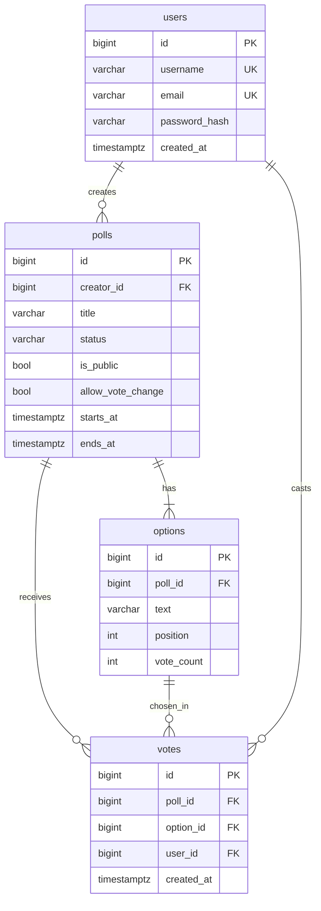
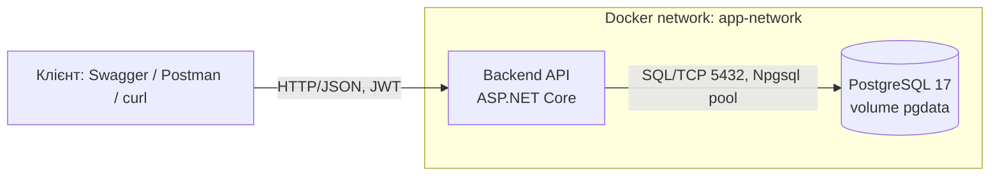

# Платформа опитувань — Highload Systems Practice

Наш варіант — платформа опитувань у реальному часі. Проєкт розвивається від лаби 1 (MVP) до лаби 5 (навантажувальне тестування); методички та дизайн-документи — у [`docs/`](docs/).

> Контекст для учасників і AI-агентів: [`CLAUDE.md`](CLAUDE.md) → [`docs/ai/`](docs/ai/status.md) (стан, рішення/ADR, контракти, runbook, журнал сесій).

**Стек:** C# / ASP.NET Core 10 · EF Core 10 + Npgsql · PostgreSQL 17 · JWT · FluentValidation · Docker Compose

## Швидкий старт

Потрібен лише Docker.

```bash
docker compose up -d --build
```

| Що | Адреса |
|---|---|
| API | http://localhost:8080 |
| Swagger UI | http://localhost:8080/swagger |
| Health check | http://localhost:8080/health |
| PostgreSQL (з хоста) | `localhost:5433`, БД/користувач/пароль `polling` |
| Adminer (опційно) | `docker compose --profile tools up -d` → http://localhost:8081 |

При старті backend сам застосовує міграції та заповнює порожню БД тестовими даними. Жодних ручних кроків не потрібно. Значення за замовчуванням можна перевизначити через `.env` (див. [`.env.example`](.env.example)).

```bash
docker compose restart postgres   # дані переживають перезапуск БД (named volume pgdata)
docker compose down -v            # повне очищення, включно з даними
```

### Тестові дані (сід)

| Дані | Значення |
|---|---|
| Користувачі | `user001@example.com` … `user500@example.com`, пароль `Password123!` |
| Опитування | 50 шт.: ~70% active, ~15% closed, ~15% draft, з голосами |
| Опитування #1 | «гаряче»: active, без голосів, `allowVoteChange = true` — ціль для write-сценарію в лабі 5 |

Генератор детермінований (фіксований seed), тож холодний старт дає ті самі дані.

### Локальна розробка без Docker для backend

```bash
docker compose up -d postgres
dotnet run --project src/PollingPlatform.Api   # http://localhost:5094/swagger, середовище Development
```

Нова міграція: `dotnet ef migrations add <Name> --project src/PollingPlatform.Api -o Data/Migrations`.

## API

Формат — JSON; помилки — RFC 7807 `application/problem+json`. Колекція запитів для демо: [`requests/polls.http`](requests/polls.http).

| Method | Endpoint | Auth | Призначення |
|---|---|---|---|
| POST | `/api/auth/register` | — | Реєстрація |
| POST | `/api/auth/login` | — | Вхід, повертає JWT |
| GET | `/api/auth/me` | JWT | Поточний користувач |
| POST | `/api/polls` | JWT | Створити опитування з варіантами (status `draft`) |
| GET | `/api/polls?status=&creatorId=&page=&pageSize=` | — | Список з фільтрами та пагінацією |
| GET | `/api/polls/{id}` | — | Деталі опитування та варіанти |
| PATCH | `/api/polls/{id}/publish` | автор | `draft → active` |
| PATCH | `/api/polls/{id}/close` | автор | Дострокове закриття, `active → closed` |
| DELETE | `/api/polls/{id}` | автор | Видалити (лише `draft`) |
| POST | `/api/polls/{id}/vote` | JWT | Голосування — *в роботі (Учасник 2)* |
| GET | `/api/polls/{id}/results` | — | Результати — *в роботі (Учасник 2)* |
| GET | `/health` | — | Готовність сервісу та стан БД |

Кожна відповідь містить заголовок `X-Instance-ID` з ідентифікатором інстансу, який її обробив (hostname контейнера або змінна `INSTANCE_ID`).

**Правила видимості:** чернетку бачить лише її автор, для інших вона повертає 404. Непублічне опитування (`isPublic = false`) не показується в загальному списку, але доступне за прямим посиланням.

**Коди помилок:**

| Код | Коли |
|---|---|
| 400 | Запит неможливо розпарсити (битий JSON, невірний тип) |
| 401 | Немає токена або токен невалідний; невірний логін |
| 403 | Дія над чужим опитуванням |
| 404 | Опитування не існує або це чужа чернетка |
| 409 | Недопустимий перехід статусу; дублікат email чи username |
| 422 | Валідація полів |

## Модель даних



Ключові обмеження:

- `UNIQUE(poll_id, user_id)` на `votes` гарантує один голос від користувача на опитування.
- `UNIQUE(poll_id, position)` на `options`.
- CHECK на `polls.status` і на умову `starts_at < ends_at`.
- `vote_count >= 0`.

Схема описана EF-міграціями в [`src/PollingPlatform.Api/Data/Migrations`](src/PollingPlatform.Api/Data/Migrations).

## Архітектура (Lab 1)



## Структура репозиторію

```
src/PollingPlatform.Api/
  Auth/          JWT, реєстрація/логін, ClaimsPrincipal.GetUserId()
  Polls/         CRUD і життєвий цикл опитувань
  Domain/        сутності User, Poll, PollOption, Vote
  Data/          DbContext, конфігурації EF, міграції, сід
  Common/        бізнес-винятки → HTTP-коди, обробник помилок, X-Instance-ID
docker-compose.yml
requests/        колекція запитів для демо
docs/            методички та дизайн-документи
docs/ai/         контекст для AI-агентів: стан, ADR, контракти, runbook, журнал сесій
CLAUDE.md        точка входу для Claude Code
```

## Розподіл відповідальності (RACI)

R — Responsible, A — Accountable, C — Consulted, I — Informed.

| Модуль | Учасник 1 | Учасник 2 |
|---|---|---|
| Каркас, Docker, мережі, volumes | R/A | I |
| Схема БД, міграції, сід | R/A | C |
| Автентифікація (JWT) | R/A | I |
| CRUD і життєвий цикл опитувань | R/A | I |
| Голосування (POST /vote) | I | R/A |
| Результати + кеш | I | R/A |
| Обробка помилок | C | R/A |
| Bottleneck Analysis | C | R/A |
| README, OpenAPI, схема C4 | R | R |

## Bottleneck Analysis

*В роботі (Учасник 2).* Чернетку див. у [`docs/ai/project-context.md`](docs/ai/project-context.md) (розділ Bottleneck analysis draft).
